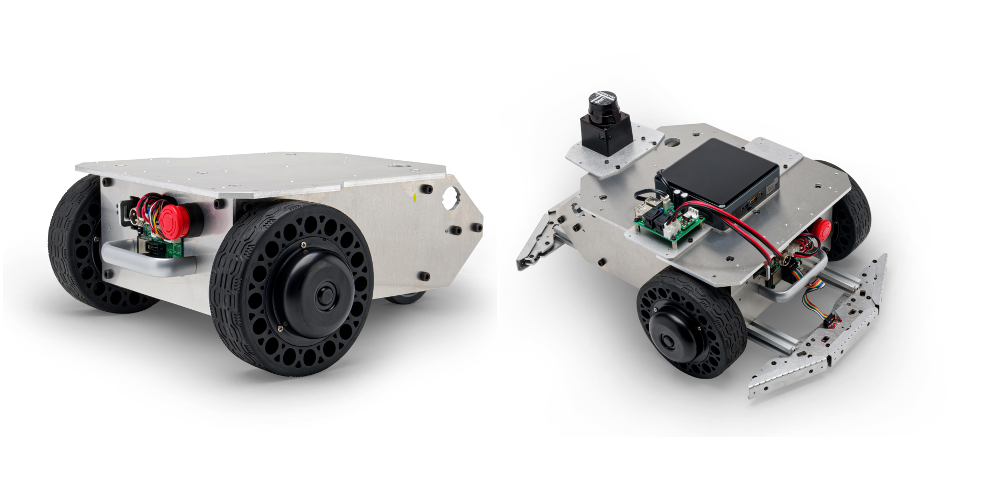

# メガローバーVer.3.0 ROS2パッケージ

<p align="center">
  
</p>

ヴイストン株式会社より発売されている全方向移動台車「[メガローバーVer.3.0](https://www.vstone.co.jp/products/wheelrobot/ver.3.0_normal.html)」をROS 2で制御するためのパッケージです。別途Linux搭載のPC及びロボット実機が必要になります。

# 目次
<!-- TOC -->

- [概要](#%E6%A6%82%E8%A6%81)
- [必要機器 & 開発環境](#%E5%BF%85%E8%A6%81%E6%A9%9F%E5%99%A8--%E9%96%8B%E7%99%BA%E7%92%B0%E5%A2%83)
- [パッケージ構成](#%E3%83%91%E3%83%83%E3%82%B1%E3%83%BC%E3%82%B8%E6%A7%8B%E6%88%90)
- [インストール方法](#%E3%82%A4%E3%83%B3%E3%82%B9%E3%83%88%E3%83%BC%E3%83%AB%E6%96%B9%E6%B3%95)
- [使用方法](#%E4%BD%BF%E7%94%A8%E6%96%B9%E6%B3%95)
    - [URDFモデルの表示](#urdf%E3%83%A2%E3%83%87%E3%83%AB%E3%81%AE%E8%A1%A8%E7%A4%BA)
    - [メガローバー（実機）との通信](#%E3%83%A1%E3%82%AC%E3%83%AD%E3%83%BC%E3%83%90%E3%83%BC%E5%AE%9F%E6%A9%9F%E3%81%A8%E3%81%AE%E9%80%9A%E4%BF%A1)
        - [有線シリアル接続の場合](#%E6%9C%89%E7%B7%9A%E3%82%B7%E3%83%AA%E3%82%A2%E3%83%AB%E6%8E%A5%E7%B6%9A%E3%81%AE%E5%A0%B4%E5%90%88)
        - [Wi-Fi 接続の場合](#wi-fi-%E6%8E%A5%E7%B6%9A%E3%81%AE%E5%A0%B4%E5%90%88)
    - [odometryをpublish](#odometry%E3%82%92publish)
    - [台車ロボットをROS 2経由で遠隔操作](#%E5%8F%B0%E8%BB%8A%E3%83%AD%E3%83%9C%E3%83%83%E3%83%88%E3%82%92ros-2%E7%B5%8C%E7%94%B1%E3%81%A7%E9%81%A0%E9%9A%94%E6%93%8D%E4%BD%9C)
        - [キーボードで操作](#%E3%82%AD%E3%83%BC%E3%83%9C%E3%83%BC%E3%83%89%E3%81%A7%E6%93%8D%E4%BD%9C)
        - [マウスで操作](#%E3%83%9E%E3%82%A6%E3%82%B9%E3%81%A7%E6%93%8D%E4%BD%9C)
    - [SLAM ToolboxでSLAM](#slam-toolbox%E3%81%A7slam)
    - [SLAM gmappingでSLAM](#slam-gmapping%E3%81%A7slam)
    - [作成した地図の保存方法](#%E4%BD%9C%E6%88%90%E3%81%97%E3%81%9F%E5%9C%B0%E5%9B%B3%E3%81%AE%E4%BF%9D%E5%AD%98%E6%96%B9%E6%B3%95)
    - [Navigation2を使用したナビゲーション](#navigation2%E3%82%92%E4%BD%BF%E7%94%A8%E3%81%97%E3%81%9F%E3%83%8A%E3%83%93%E3%82%B2%E3%83%BC%E3%82%B7%E3%83%A7%E3%83%B3)
    - [gazeboを使用したシミュレーション](#gazebo%E3%82%92%E4%BD%BF%E7%94%A8%E3%81%97%E3%81%9F%E3%82%B7%E3%83%9F%E3%83%A5%E3%83%AC%E3%83%BC%E3%82%B7%E3%83%A7%E3%83%B3)
- [ライセンス](#%E3%83%A9%E3%82%A4%E3%82%BB%E3%83%B3%E3%82%B9)
- [貢献](#%E8%B2%A2%E7%8C%AE)

<!-- /TOC -->

## 概要

このパッケージは、メガローバーVer.3.0台車ロボット用のROS 2パッケージを提供します。このパッケージには、ロボットの制御、センサーの読み取り、およびロボットのアプリケーションの開発に必要なノードが含まれています。

## 必要機器 & 開発環境
- メガローバーVer.3.0:
  - 製品ページ: [https://www.vstone.co.jp/products/wheelrobot/ver.3.0_normal.html](https://www.vstone.co.jp/products/wheelrobot/ver.3.0_normal.html)
  - 販売ページ: [https://www.vstone.co.jp/robotshop/index.php?main_page=product_info&cPath=156_923&products_id=5338](https://www.vstone.co.jp/robotshop/index.php?main_page=product_info&cPath=156_923&products_id=5338)
- Ubuntu Linux - Jammy Jellyfish (22.04)
- ROS 2 Humble Hawksbill

## ファイルの構成
   ```
    ros2_ws/src
    ├ megarover3_ros2
    │　├ megarover3
    │　├ megarover3_bringup
    │　├ megarover3_navigation
    │　├ megarover3_gazebo
    │　└ megarover_description
    ├ slam_gmapping
    ├ vs_rover_options_description
    └ ydlidar_ros2_driver
   ```

## パッケージ構成
- `megarover3`: メガローバーVer.3.0のメタパッケージ。
- `megarover3_bringup`: メガローバーVer.3.0の起動に関連するノードやlaunchファイルを提供します。
- `megarover3_navigation`: メガローバーVer.3.0のSLAMやnavigationに関連するノードやlaunchファイルを含んでいるパッケージです。
- `megarover_description`: メガローバーVer.3.0の物理モデルやURDFモデルを含んでいるパッケージです。
- `megarover3_gazebo`: メガローバーVer.3.0のgazebo起動に関連するノードやlaunchファイルを提供します。

## インストール方法

このパッケージをインストールするには、以下の手順に従ってください。

1. [こちら](https://docs.ros.org/en/humble/Installation.html)の手順に従って、ROS 2 Humbleをインストールしてください。
2. [micro-ROS](https://micro.ros.org/) Agent のセットアップ: *(実機を動かす場合のみ必要)*

   ```bash
   $ mkdir -p ~/uros_ws/src
   $ cd ~/uros_ws/src
   $ git clone -b $ROS_DISTRO https://github.com/micro-ROS/micro_ros_setup.git
   $ cd ~/uros_ws
   $ rosdep update && rosdep install --from-paths src --ignore-src -y
   $ colcon build
   $ source install/local_setup.bash

   $ ros2 run micro_ros_setup create_agent_ws.sh
   $ ros2 run micro_ros_setup build_agent.sh
   $ source install/local_setup.bash
   ```

3. 必要なリポジトリをワークスペースにクローンしてください:

   ```bash
   $ mkdir -p ~/ros2_ws/src
   $ cd ~/ros2_ws/src
   $ git clone -b humble_gazebo https://github.com/vstoneofficial/megarover3_ros2.git --recurse-submodules
   $ git clone -b humble_gazebo https://github.com/vstoneofficial/vs_rover_options_description.git  # オプションを表示するため
   $ sudo xargs -a ~/ros2_ws/src/megarover3_ros2/packages.txt apt install -y
   $ rosdep install -r --from-paths . --ignore-src --rosdistro $ROS_DISTRO -y
   ```

4. ワークスペースをビルド:

   ```bash
   $ cd ~/ros2_ws
   $ colcon build --symlink-install
   ```

5. ワークスペースのオーバレイ作業:

   ```bash
   source ~/ros2_ws/install/local_setup.bash
   ```

6. シェルを起動時にワークスペースがオーバーレイされるように設定します。

   ```bash
   $ echo "source ~/uros_ws/install/local_setup.bash" >> ~/.bashrc 
   $ echo "source ~/ros2_ws/install/local_setup.bash" >> ~/.bashrc
   ```

## 使用方法

このパッケージには、以下の主要な機能が含まれています。（詳細は各ファイルを確認してください）

### URDFモデルの表示
以下のコマンドを実行して、メガローバーのURDFモデルを表示します。
   ```
   ros2 launch megarover_description mega3_view.launch.py
   ```

### メガローバー（実機）との通信
  ROS 2とMicro-ROSを統合するためのエージェントノードを起動。
  
#### 有線シリアル接続の場合
   ```
   ros2 run micro_ros_agent micro_ros_agent serial --dev /dev/ttyUSB0 --baudrate 921600 -v4
   ```
      
#### Wi-Fi 接続の場合
   ```
   ros2 run micro_ros_agent micro_ros_agent udp4 --port 8888
   ```

### odometryをpublish
pub_odomノードとrviz上可視化
   ```
   ros2 launch megarover3_bringup robot.launch.py
   ```

### 台車ロボットをROS 2経由で遠隔操作
#### キーボードで操作
キーボードを使用してロボットを操作するためのノードを起動。
   ```
   ros2 run teleop_twist_keyboard teleop_twist_keyboard --ros-args --remap cmd_vel:=rover_twist
   ```

#### マウスで操作
マウスを使用してロボットを操作するためのノードを起動。
   ```
   ros2 launch megarover3_bringup mouse_teleop.launch.py
   ```

### SLAM ToolboxでSLAM
  ToolboxはROS2のナビゲーション機（Nav2）と一緒に使える標準的なパッケージです。  
  現在も活発に更新が続いており、広い範囲での地図作成やループ修正にも対応しています。  
  実際にロボットを動かす場面ではこのパッケージの利用を推奨します。

1. LRFオプションTG30
   - [ydlidar_ros2_driver](https://github.com/YDLIDAR/ydlidar_ros2_driver.git)を`src`フォルダにクローンして、buildしてください。
      ```
      git clone -b humble https://github.com/YDLIDAR/ydlidar_ros2_driver.git
      ```
   - LRFに関するパラメータは[TG30.yaml](./megarover3_bringup/params/TG30.yaml)にあります。

   > **Warning**
   > ydlidar_ros2_driverの中のydlidar_ros2_driver_node.cppを修正が必要。[詳細](https://github.com/YDLIDAR/ydlidar_ros2_driver/pull/20)

1. SLAM Toolboxの準備
   下記のコマンドでSLAM Toolboxをインストールする。
   ```
   sudo apt install ros-humble-slam-toolbox
   ```

2. SLAM ToolboxでSLAMする。
   - ロボット実機と通信できたら、以下のコマンドでodom publisher、ロボットのurdf表示、LiDAR関連のlaunchファイルを起動します。
      ```
      ros2 launch megarover3_bringup robot.launch.py rover:=mega3 option:=_lrf
      ```

   - 新しいターミナルで以下のコマンドを使用してSLAMを開始します。
      ```
      ros2 launch megarover3_navigation slam.launch.py
      ```
      付属のVS-C3無線コントローラもしくはROS 2のteleopで動かして、mappingする。

   - メガローバーVer.3.0用のSLAM Toolboxのパラメータは`megarover3_navigation`パッケージの[`config`](./megarover3_navigation/config/) フォルダにあります。

### SLAM gmappingでSLAM
  gmappingはROS1時代から広く使われてきたSLAMの手法です。  
  ROS2版も存在しますが公式での開発はすでに終了しており、有志による移植パッケージが提供されています。  
  そのため十分なサポートは期待できず、実用利用にはあまり適していません。
  ただし学習や体験を目的に「まずは地図を作る流れを試してみたい」といった場合には活用できます。

1. [SLAM gmapping](https://github.com/Project-MANAS/slam_gmapping)を`src`フォルダにクローンして、buildしてください。

   ```
   git clone https://github.com/Project-MANAS/slam_gmapping.git
   ```

2. SLAM gmappingでSLAMする。
   - ロボット実機と通信できたら、以下のコマンドでodom publisher、ロボットのurdf表示、LiDAR関連のlaunchファイルを起動します。
      ```
      ros2 launch megarover3_bringup robot.launch.py rover:=mega3 option:=_lrf
      ```

   - 新しいターミナルで以下のコマンドを使用してSLAMを開始します。
      ```
      ros2 launch megarover3_navigation gmapping.launch.py
      ```
      付属のVS-C3無線コントローラもしくはROS 2のteleopで動かして、mappingする。

   - メガローバーVer.3.0用のSLAM gmappingのパラメータは[`slam_gmapping.cpp`](https://github.com/Project-MANAS/slam_gmapping/blob/eloquent-devel/slam_gmapping/src/slam_gmapping.cpp)にあります。\
   [ROS 2 workspaceにクローンした場合](../slam_gmapping/slam_gmapping/src/slam_gmapping.cpp)
   - 変更下パラメータは下記のようになります。
      ```cpp
      base_frame_ = "base_footprint";
      maxUrange_ = 29.9;  maxRange_ = 30.0;
      minimum_score_ = 500;
      ```

### 作成した地図の保存方法
下記のコマンドで地図を`megarover3_ros2/megarover3_navigation/maps/`フォルダ内に保存する。
   ```
   ros2 run nav2_map_server map_saver_cli -f ~/ros2_ws/src/megarover3_ros2/megarover3_navigation/maps/YOUR_MAP_NAME
   ```

### Navigation2を使用したナビゲーション
1. Nav2パッケージをインストールする。
   ```
   $ sudo apt install ros-humble-navigation2
   $ sudo apt install ros-humble-nav2-bringup
   ```

2. Nav2でナビゲーションする。
   - ロボット実機と通信できたら、以下のコマンドでodom publisher、ロボットのurdf表示、LiDAR関連のlaunchファイルを起動します。
      ```
      ros2 launch megarover3_bringup robot.launch.py rover:=mega3 option:=_lrf
      ```
   
   - [`navigation.launch.py`](./megarover3_navigation/launch/navigation.launch.py#L35) の行35のマップ名を使用したいマップ名に変更する。\
   新しいターミナルで以下のコマンドを使用してナビゲーションを開始します。
      ```
      ros2 launch megarover3_navigation navigation.launch.py
      ```
   - メガローバーVer.3.0用のNavigation2のパラメータは`megarover3_navigation`パッケージの[`config/nav2_params.yaml`](./megarover3_navigation/config/nav2_params.yaml) フォルダにあります。
### gazeboを使用したシミュレーション
   - 初回のgazeboを起動する際に環境変数を更新します。
      ```
      source /usr/share/gazebo/setup.sh
      ```
   
   - シェルを起動時にgazeboのオーバーレイされるように設定します。
      ```
      echo "source /usr/share/gazebo/setup.sh" >> ~/.bashrc 
      ```


#### gazeboでシミュレーションする。
   - 

1. 空のワールドを起動します。

   ```
   ros2 launch megarover3_gazebo gazebo_bringup.launch.py
   ```

2. 壁をシミュレータ内にインポートします

   ```
   ros2 launch megarover3_gazebo spawn_wall.launch.py
   ```

3. ローバーをマウスで遠隔操作するには、新しいターミナル ウィンドウで以下のコマンドを使用して遠隔操作ノードを起動します。

   ```
   ros2 launch megarover3_bringup mouse_teleop.launch.py
   ```

#### gazeboでSLAMする。

1. gazebo serverとSLAMノードを起動します。

   ```
   ros2 launch megarover3_gazebo gazebo_slam.launch.py 
   ```

2. ローバーをマウスで遠隔操作するには、新しいターミナル ウィンドウで以下のコマンドを使用して遠隔操作ノードを起動します。

   ```
   ros2 launch megarover3_bringup mouse_teleop.launch.py
   ```

3. 下記のコマンドで地図を`megarover3_ros2/megarover3_gazebo/maps/`フォルダ内に保存する。

   ```
   ros2 run nav2_map_server map_saver_cli -f ~/ros2_ws/src/megarover3_ros2/megarover3_gazebo/maps/YOUR_MAP_NAME
   ```

#### gazeboでナビゲーションする。
- [`gazebo_nav.launch.py`](./megarover3_gazebo/launch/gazebo_nav.launch.py#L35) の行35のマップ名を使用したいマップ名に変更する。
   　 次の行を探し、“ファイル名.yaml”を、先ほど保存，移動させた地図ファイルのファイル名に合わせて設定します。

   ```
      get_package_share_directory('megarover3_gazebo'),
      'maps',
      'YOUR_MAP_NAME.yaml'))
   ```
   
- gazebo serverとNav2ノードを起動します。

   ```
   ros2 launch megarover3_gazebo gazebo_nav.launch.py 
   ```


## ライセンス

このパッケージはApache 2.0ライセンスの下で提供されています。詳細については、[LICENSE](./LICENSE)ファイルを参照してください。

## 貢献

バグの報告や機能の提案など、このパッケージへの貢献は大歓迎です。プルリクエストやイシューを使用して、issueをご利用ください。
